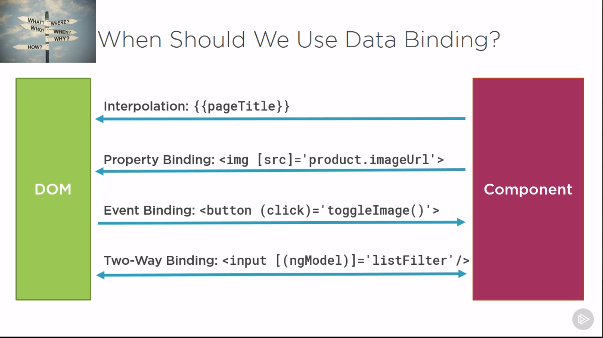

### Angular CLI

Instalacja:

`npm install -g @angular/cli`

Pomoc / przegląd możliwości:

`ng help`

Nowy projekt:

`ng new hello-world`

`ng new --help`

Uruchomienie:

`ng serve`

`npm start`

`ng serve -o` Uruchamia aplikację i uruchamia automatycznie domyślną przeglądarkę

Generowanie:

`ng g --help`

`ng g c welcome` Wygeneruje komponent 'welcome' 

Testowanie:

`ng test` Unit testy - Karma
`ng e2e` Testy end to end - Protrotractor

Deploy

`ng build` Buduje aplikacje tworząc folder 'dist'

`ng build --prod` Buduje aplikacje dodatkowo optymalizując kod pod produkcję

`ng buld --help`

`ng build --base-href` Ustawienie base URL np. dla produkcji

### Angular Binding

